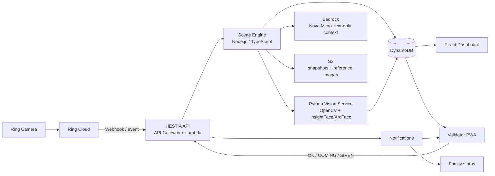
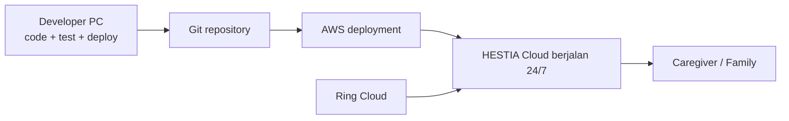
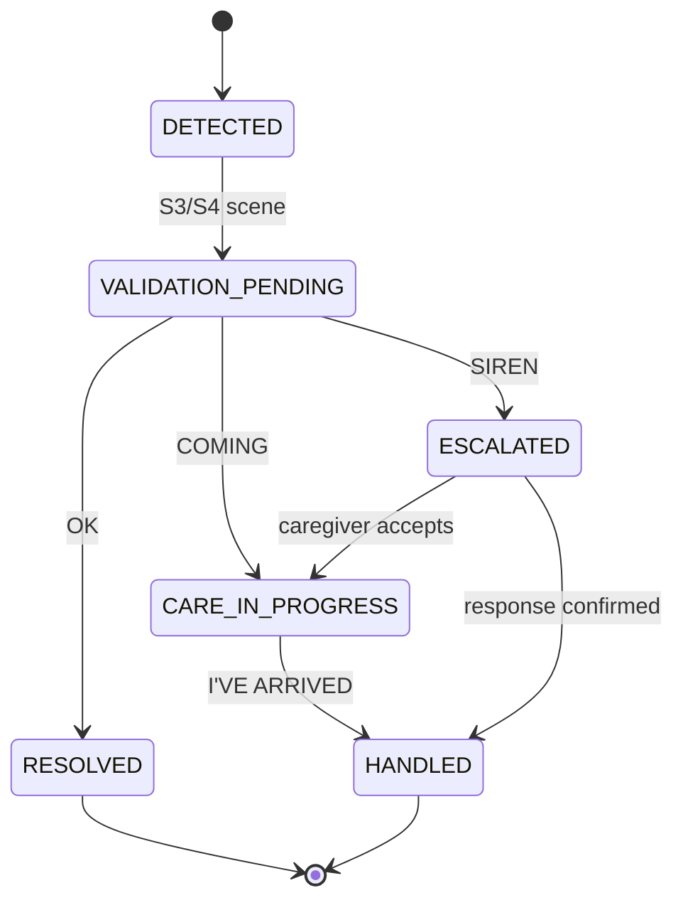
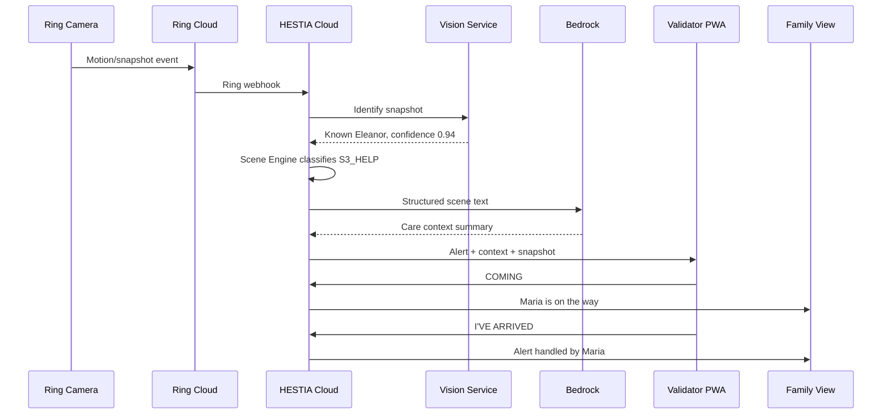

# HESTIA — Sprint MVP

> **A home that cares, even when you're away.**

Dokumen ini adalah baseline implementasi MVP HESTIA untuk hackathon. Fokusnya adalah satu alur demo yang utuh dan dapat dipercaya: **Ring menangkap event → HESTIA memahami scene → caregiver memvalidasi → keluarga mengetahui status penanganan**.

## 1. Keputusan arsitektur

HESTIA berjalan di AWS/cloud setelah deployment. PC developer hanya digunakan untuk development, pengujian, dan deployment; PC tidak menjadi server permanen dan tidak perlu online agar sistem bekerja.



### Peran tiap lapisan

| Lapisan | Menjawab | Tanggung jawab MVP |
|---|---|---|
| Ring Camera + Ring Cloud | **Apa yang terlihat/terjadi?** | Menghasilkan motion, doorbell, device, atau snapshot event |
| Face Recognition | **Siapa?** | Mendeteksi wajah dan mencocokkan identitas resident |
| Scene Engine | **Apa maknanya?** | Menggabungkan event, identitas, lokasi, dan aturan menjadi scene S1–S4 |
| Bedrock | **Bagaimana menjelaskannya?** | Mengubah structured event menjadi ringkasan care yang mudah dibaca |
| Validator | **Apa keputusan manusia?** | Caregiver/PIC memilih OK, COMING, SIREN, atau I'VE ARRIVED |
| Notifications | **Apakah ada yang merespons?** | Mendistribusikan alert dan status penanganan ke pihak terkait |

### Batasan Bedrock yang wajib

**Amazon Nova Micro adalah model text-only.** Nova Micro tidak boleh digunakan untuk menganalisis image/video, mendeteksi wajah, atau melakukan face recognition. Visual processing dilakukan oleh Ring/Python Vision Service. Bedrock menerima structured text setelah scene terbentuk.

```text
Ring snapshot/event
        ↓
Python Vision Service → identity result
        ↓
Scene Engine → structured scene event
        ↓
Bedrock Nova Micro → human-readable care context
```

Jika di masa depan dibutuhkan pemahaman visual langsung dari Bedrock, gunakan model multimodal yang sesuai sebagai keputusan arsitektur terpisah—bukan bagian dari MVP ini.

## 2. Prinsip lean MVP

MVP menggunakan satu backend TypeScript yang mengorkestrasi webhook, scene rules, Bedrock, persistence, dan notifications. Scene Engine adalah module di dalam backend, bukan service mandiri.

### Termasuk dalam MVP

- React + TypeScript dashboard.
- React PWA untuk Validator mobile.
- Node.js + TypeScript API/Lambda.
- Ring webhook/event ingestion dengan validasi signature bila tersedia.
- DynamoDB untuk events, scenes, residents, alerts, dan audit sederhana.
- S3 untuk snapshot/reference images yang memang diperlukan.
- Bedrock Nova Micro untuk context text.
- Python Vision Service terpisah dengan OpenCV + InsightFace/ArcFace.
- Notification sederhana untuk alert dan perubahan state.
- Demo fixtures agar alur dapat dipresentasikan secara deterministik.

### Tidak termasuk dalam MVP

- EventBridge sebagai lapisan wajib.
- Step Functions atau workflow orchestration kompleks.
- Banyak Lambda microservices.
- Cognito dengan konfigurasi produksi yang kompleks.
- Production-grade analytics, predictive AI, multi-home, atau fleet management.
- Live video processing terus-menerus.
- Face recognition langsung di Lambda dengan dependency native berat.
- SLA/escalation engine yang kompleks.

Komponen tersebut dapat masuk roadmap setelah vertical slice MVP stabil.

## 3. Runtime dan deployment



Python Vision Service sebaiknya dibuat sebagai container agar OpenCV, InsightFace, model, dan native dependencies terisolasi.

```text
AWS Lambda / API
        │ HTTPS
        ▼
Python Vision Service
        ├── FastAPI
        ├── OpenCV
        ├── InsightFace / ArcFace
        └── NumPy + embedding matching
```

Target deployment yang disarankan: **AWS ECS/Fargate**. Untuk demo awal, service dapat dijalankan pada satu task/container cloud sederhana, selama endpoint-nya dapat diakses backend dan PC developer tidak menjadi dependency runtime.

## 4. Kontrak data inti

### Ring event

```ts
type RingEvent = {
  eventId: string;
  deviceId: string;
  eventType: "motion" | "doorbell" | "device_status" | "snapshot";
  occurredAt: string;
  roomId: string;
  snapshotUrl?: string;
  metadata?: Record<string, string>;
};
```

### Identity result

```ts
type IdentityResult = {
  identity: "known" | "unknown" | "not_detected";
  residentId?: string;
  name?: string;
  confidence?: number;
  faceCount: number;
  source: "ring_snapshot";
};
```

### Scene event

```ts
type SceneCode = "S1_NORMAL" | "S2_WATCH" | "S3_HELP" | "S4_CRITICAL";

type SceneEvent = {
  sceneId: string;
  eventId: string;
  scene: SceneCode;
  confidence: number;
  residentId?: string;
  roomId: string;
  signals: string[];
  identity?: IdentityResult;
  contextText?: string;
  createdAt: string;
};
```

### Validator action

```ts
type ValidatorAction =
  | { action: "OK"; alertId: string; actorId: string }
  | { action: "COMING"; alertId: string; actorId: string; etaMinutes?: number }
  | { action: "SIREN"; alertId: string; actorId: string }
  | { action: "I_HAVE_ARRIVED"; alertId: string; actorId: string };
```

## 5. State machine care response



Makna aksi:

- **OK** — alert sudah diperiksa dan selesai.
- **COMING** — caregiver bergerak; status dibagikan agar caregiver lain dan keluarga tidak panik atau merespons ganda.
- **SIREN** — minta perhatian lebih luas melalui notification sederhana.
- **I’VE ARRIVED** — care sudah ditangani secara langsung.

## 6. API MVP

| Method | Endpoint | Fungsi |
|---|---|---|
| `POST` | `/webhooks/ring` | Menerima dan memvalidasi Ring event |
| `POST` | `/internal/vision/identify` | Dipanggil backend ke Vision Service |
| `GET` | `/scenes` | Mengambil scene terbaru untuk dashboard |
| `GET` | `/alerts/active` | Mengambil alert yang membutuhkan respons |
| `POST` | `/alerts/:id/actions` | Menjalankan OK/COMING/SIREN/I’VE ARRIVED |
| `GET` | `/residents/:id` | Mengambil profil resident dan status |
| `POST` | `/demo/events` | Memicu fixture event untuk presentasi |

Contoh request Bedrock setelah Scene Engine selesai:

```json
{
  "resident": "Eleanor",
  "room": "Living Room",
  "scene": "S3_HELP",
  "confidence": 0.87,
  "signals": [
    "repeated_motion",
    "person_stationary",
    "possible_help_vocalization",
    "known_resident"
  ]
}
```

Contoh output context:

```text
Possible distress detected. Eleanor has shown repeated movement near the chair
with a possible verbal distress signal. Caregiver validation is required.
```

## 7. Struktur repository

```text
hestia/
├── apps/
│   ├── dashboard/                 # React + TypeScript
│   └── validator-pwa/             # mobile-first React PWA
├── services/
│   ├── api/                       # Node.js/TypeScript Lambda entrypoints
│   ├── scene-engine/              # module: rules + state transitions
│   ├── vision/                    # Python FastAPI container
│   │   ├── app/
│   │   ├── models/
│   │   └── Dockerfile
│   └── shared/                    # types, schemas, constants
├── infrastructure/
│   ├── api-gateway/
│   ├── lambda/
│   ├── dynamodb/
│   ├── s3/
│   └── ecs-vision/
├── fixtures/
│   ├── residents/                 # Eleanor reference images
│   ├── ring-events/
│   └── scenes/
├── docs/
│   ├── HESTIA-SPRINT-MVP.md
│   └── DEMO.md
└── README.md
```

## 8. Frontend UI/UX specification

### 8.1 UX product philosophy

HESTIA **bukan Ring viewer** dan bukan surveillance dashboard. HESTIA adalah **elder-care command center / care operating system**: produk yang membantu caregiver memahami situasi, mengambil tindakan, dan memberi reassurance kepada keluarga.

Hierarki informasi utama harus selalu mengikuti:

```text
Person → Activity → Scene → Care Action
```

Pengalaman harus terasa calm, trustworthy, human, dan low-noise. UI tidak boleh memaksa caregiver menerjemahkan telemetry atau output AI mentah sebelum memahami siapa yang membutuhkan perhatian dan tindakan apa yang diperlukan.

### 8.2 Visual design direction

Gunakan arah visual modern yang terinspirasi oleh **UniFi / Ubiquiti Controller**: flat, dynamic, elegant, clean, dengan information density yang tenang dan terkontrol.

| Token semantik | Makna |
|---|---|
| Warm amber | Home dan human care |
| Deep teal | Technology dan system context |
| Green | Safe / normal |
| Muted red | Intervention / attention required |

Hindari hologram berlebihan, cyberpunk styling, glowing effects, dan visual overload bergaya “AI dashboard”. Warna dan motion digunakan untuk membantu prioritas, bukan untuk membuat rumah terasa seperti ruang kontrol darurat ketika tidak ada emergency.

### 8.3 UI/UX visual references

Referensi visual berikut adalah **implementation references**, bukan sekadar inspirasi. Implementasi frontend harus mempertahankan keputusan visual dan interaction model yang ditunjukkan oleh mockup.

#### Dashboard

Reference: `docs/references/dashboard-mockup.png`

Implementasi harus mempertahankan:

- overall information hierarchy;
- calm visual density;
- room/status cards;
- alert prominence;
- navigation structure;
- semantic status treatment.

#### Validator Mobile

Reference: `docs/references/validator-mobile-mockup.png`

Implementasi harus mempertahankan:

- fast-action interaction;
- prominent alert state;
- resident/location context;
- OK / COMING / SIREN actions;
- care-in-progress state;
- handled confirmation.

### 8.4 Main dashboard information architecture

Dashboard desktop adalah **Care Command Center** dengan struktur berikut:

- **Left navigation** untuk Dashboard, Alerts, Residents, Activity, dan System Status.
- **Top contextual header** dengan waktu, rumah, caregiver aktif, dan contextual greeting.
- **Home status** yang merangkum apakah rumah online, aman, dan kapan aktivitas terakhir terjadi.
- **Elder/resident status** dengan nama, lokasi terakhir, status scene, dan kebutuhan perhatian.
- **Room cards** untuk status per ruangan dan scene terbaru.
- **Active alerts** yang diurutkan berdasarkan urgensi dan menunjukkan ownership/respons.
- **Activity timeline/feed** untuk urutan event yang mudah dipahami manusia.
- **Home/floor map** yang cukup sederhana untuk menunjukkan lokasi, bukan peta teknis real-time yang berlebihan.
- **Care team** untuk melihat siapa yang tersedia, sedang menuju lokasi, atau sudah menangani alert.
- **System/integration status** untuk Ring, API, Vision Service, notifications, dan mode demo.

Dashboard harus menjawab, dalam urutan yang mudah dipindai: **Who? Where? What happened? How serious? Who is handling it?**

Gunakan contextual greeting untuk memberi orientasi, misalnya:

```text
Good evening, Maria. Eleanor is home and comfortable.
```

Jika ada alert, gunakan bahasa yang berorientasi care action:

```text
Eleanor may need your attention.
```

### 8.5 Scene UX

Empat scene berikut adalah status semantik yang harus konsisten pada room cards, active alerts, activity feed, dan dashboard status:

```text
S1 NORMAL
S2 WATCH
S3 HELP
S4 CRITICAL
```

- **S1 NORMAL** — keadaan aman/normal; gunakan green dan treatment visual yang tenang.
- **S2 WATCH** — perlu dipantau; gunakan amber atau neutral emphasis tanpa alarm visual.
- **S3 HELP** — kemungkinan membutuhkan intervensi caregiver; gunakan muted red dengan context dan action yang jelas.
- **S4 CRITICAL** — membutuhkan respons segera; gunakan muted red yang lebih kuat, status ownership, dan jalur eskalasi.

Scene code, warna, label, icon, dan copy harus memiliki arti yang sama di seluruh permukaan UI. S1 dan S2 tidak boleh tampak seperti emergency; S3 dan S4 harus mudah ditemukan tanpa membuat seluruh dashboard terasa menegangkan saat tidak ada keadaan darurat.

### 8.6 Alert UX

Alert tidak menampilkan raw AI output sebagai beban interpretasi caregiver. Setiap alert disusun sebagai:

```text
Person → Location → Event → Confidence → Required action
```

Contoh: **Eleanor → Bedroom → possible distress detected → 87% confidence → caregiver validation required**. Context text boleh berasal dari Bedrock, tetapi UI tetap menonjolkan fakta, tingkat kepastian, dan tindakan yang tersedia. Confidence harus membantu keputusan, bukan memberi kesan kepastian palsu.

### 8.7 Validator PWA: Fast Action Interface

Validator adalah **Fast Action Interface**, bukan versi mini dari dashboard. Ia hanya menampilkan context minimum yang diperlukan untuk keputusan cepat dari HP:

```text
🔴 HELP
Possible distress detected

Eleanor
Bedroom

[ OK ]
[ COMING ]
[ SIREN ]
```

Setelah caregiver memilih **COMING**, flow statusnya adalah:

```text
COMING
↓
CARE IN PROGRESS
↓
I'VE ARRIVED
↓
ALERT HANDLED
```

Tujuan UX-nya adalah caregiver dapat mengakui tanggung jawab dalam hitungan detik, sementara keluarga menerima reassurance bahwa seseorang sedang menangani situasi. Tombol harus besar, jelas, mudah ditekan, dan aman terhadap loading, retry, serta koneksi yang tidak stabil.

### 8.8 Responsive design

```text
Desktop → Care Command Center
Mobile  → Fast Care Action / Validator
```

Desktop dapat menampilkan seluruh context dashboard. Mobile memprioritaskan immediate action dan tidak perlu menampilkan setiap fitur dashboard, map, analytics, atau system detail.

### 8.9 Frontend technology

Stack frontend MVP harus konsisten dengan arsitektur berikut:

- React
- TypeScript
- Vite
- Tailwind CSS
- shadcn/ui
- Lucide icons
- React Router
- TanStack Query
- Recharts bila memang membantu untuk visualisasi yang relevan
- PWA/Web Push untuk Validator

Jangan menambahkan framework frontend lain, design system besar, micro-frontend, atau state-management framework kompleks tanpa justifikasi MVP yang jelas.

### 8.10 Frontend component/page structure

Struktur berikut cukup praktis dan proporsional untuk hackathon MVP:

```text
src/
├── app/
├── components/
│   ├── dashboard/
│   ├── rooms/
│   ├── alerts/
│   ├── activity/
│   ├── care-team/
│   └── system-status/
├── pages/
│   ├── Dashboard/
│   ├── Alerts/
│   └── Validator/
├── scenes/
└── services/
```

Folder separation boleh disesuaikan dengan monorepo pada bagian repository; tujuan struktur ini adalah menjaga pemisahan yang jelas tanpa overengineering.

### 8.11 UI/UX acceptance criteria

- [ ] Dashboard memprioritaskan Person → Activity → Scene → Care Action dan dapat menjawab Who, Where, What happened, How serious, dan Who is handling it.
- [ ] S1–S4 memiliki label, warna, icon, dan treatment konsisten pada room cards, alerts, activity feed, dan dashboard status.
- [ ] Tidak ada emergency styling berlebihan ketika hanya ada S1 NORMAL atau S2 WATCH.
- [ ] Alert menampilkan person, location, event, confidence, context, dan required action tanpa mengharuskan caregiver membaca raw AI output.
- [ ] Validator dapat menyelesaikan OK/COMING/SIREN dalam beberapa detik dari mobile.
- [ ] Flow COMING → CARE IN PROGRESS → I'VE ARRIVED → ALERT HANDLED terlihat jelas dan statusnya dipropagasikan ke dashboard/family view.
- [ ] Desktop berfungsi sebagai Care Command Center; mobile berfungsi sebagai Fast Care Action / Validator.
- [ ] Loading, empty, error, retry, dan offline-safe states tersedia untuk alur utama.
- [ ] Visual tetap flat, clean, calm, dan human; tidak bergantung pada hologram, cyberpunk, glow, atau dashboard overload.

## 9. Sprint plan

### Sprint 0 — Cloud skeleton dan demo contract

**Goal:** semua komponen memiliki kontrak sederhana dan deployment target jelas.

- [ ] Buat monorepo dan shared types.
- [ ] Buat React + TypeScript + Vite shell dengan Tailwind CSS, shadcn/ui, Lucide icons, React Router, dan TanStack Query.
- [ ] Buat dashboard shell dengan left navigation, contextual header, home/resident status, room cards, active alerts, activity feed, care team, dan system status placeholders.
- [ ] Buat Validator PWA shell mobile-first sebagai Fast Action Interface, bukan mini dashboard.
- [ ] Buat API/Lambda health endpoint.
- [ ] Siapkan DynamoDB table MVP dan S3 bucket.
- [ ] Siapkan satu environment AWS untuk demo.
- [ ] Pastikan deployment dapat dilakukan dari PC lalu runtime tetap berjalan tanpa PC.

**Checkpoint:** dashboard dan PWA memanggil API cloud yang telah dideploy.

### Sprint 1 — Vertical slice Ring → Alert

**Goal:** event Ring atau fixture event menghasilkan alert yang tampil.

- [ ] Implementasi `POST /webhooks/ring`.
- [ ] Validasi event dan simpan ke DynamoDB.
- [ ] Buat Scene Engine sebagai module TypeScript.
- [ ] Implementasi S1, S2, S3, S4 berbasis rule sederhana.
- [ ] Buat alert S3 di dashboard dan Validator PWA dengan urutan Person → Location → Event → Confidence → Required action.
- [ ] Terapkan label dan visual state S1–S4 secara konsisten pada room cards, alerts, activity feed, dan dashboard status.
- [ ] Tambahkan `/demo/events` untuk fallback demo.

**Checkpoint:** `Ring/fixture → API → Scene Engine → DynamoDB → Dashboard/Validator`.

### Sprint 2 — Validator response loop

**Goal:** caregiver dapat merespons cepat dari HP.

- [ ] UI alert mobile-first Fast Action Interface dengan resident, room, scene, confidence, context, dan required action.
- [ ] Tombol OK, COMING, SIREN.
- [ ] Tombol I’VE ARRIVED pada status CARE IN PROGRESS.
- [ ] Implementasikan flow COMING → CARE IN PROGRESS → I’VE ARRIVED → ALERT HANDLED dengan feedback loading, success, retry, dan offline-safe yang wajar.
- [ ] Terapkan state machine dan audit event sederhana.
- [ ] Tampilkan status terkini pada dashboard dan family view.

**Checkpoint:** `S3 → notification → COMING → family sees CARE IN PROGRESS → I’VE ARRIVED → HANDLED`.

### Sprint 3 — Bedrock context

**Goal:** structured scene menjadi ringkasan yang manusiawi.

- [ ] Buat Bedrock adapter di backend.
- [ ] Kirim structured text, bukan image/video, ke Nova Micro.
- [ ] Simpan context result bersama scene.
- [ ] Tambahkan fallback text lokal bila Bedrock gagal.
- [ ] Pastikan AI tidak mengubah keputusan validator.

**Checkpoint:** context membantu caregiver memahami situasi tanpa menghapus human decision.

### Sprint 4 — Python Vision Service

**Goal:** tambahkan jawaban “siapa?” tanpa mengganggu vertical slice.

- [ ] Buat container FastAPI terpisah.
- [ ] Implementasi OpenCV face detection.
- [ ] Implementasi InsightFace/ArcFace embedding.
- [ ] Implementasi cosine similarity terhadap resident templates.
- [ ] Simpan reference images di S3 dan metadata di DynamoDB.
- [ ] Hubungkan backend ke `/internal/vision/identify`.
- [ ] Gunakan confidence dan `unknown` secara konservatif.

**Checkpoint:** snapshot fixture dapat menghasilkan `KNOWN_TARGET: Eleanor` atau `UNKNOWN`; face template hanya berasal dari resident target yang dilatih/terdaftar. Hasil identity memperkaya scene, bukan menentukan alert sendirian. Orang non-target tidak otomatis memicu siren.

### Sprint 5 — Demo polish dan reliability

- [ ] Tambahkan loading, empty, error, retry, dan offline-safe states pada dashboard dan PWA.
- [ ] Pastikan tombol alert besar, mudah ditekan, dan memiliki feedback action yang jelas.
- [ ] Uji responsive behavior: desktop sebagai Care Command Center dan mobile sebagai Fast Care Action / Validator.
- [ ] Rapikan visual consistency untuk typography, spacing, scene colors, labels, icons, dan alert interaction polish.
- [ ] Pastikan contextual greeting, alert context, care-team ownership, dan system status tidak saling bertentangan.
- [ ] Tambahkan demo controls: NORMAL, WATCH, HELP, CRITICAL, UNKNOWN.
- [ ] Uji ulang deployment cloud tanpa PC runtime.
- [ ] Uji notification dan status propagation.
- [ ] Siapkan screenshot/video dan script presentasi.

## 10. Prioritas kerja

| Area | Prioritas | Catatan |
|---|---:|---|
| Ring webhook/event fixture | P0 | Sumber input utama |
| Scene Engine | P0 | Inti deterministik HESTIA |
| Validator PWA | P0 | Killer feature human-in-the-loop |
| Alert state propagation | P0 | Membuktikan response loop |
| Bedrock context | P0 | AI menjelaskan, bukan memutuskan |
| Dashboard | P0 | Visibilitas operator/family |
| Python face recognition | P1 | Tambahkan setelah alur utama stabil |
| Multi-room map | P1 | Cukup satu-dua room untuk demo |
| Audit UI | P1 | Log dasar dulu |
| Analytics/predictive AI | P2 | Bukan bagian MVP |

Aturan praktis: jika waktu terbatas, selesaikan **Ring/fixture → alert → Validator → family status** lebih dahulu. Face recognition dan visual polish tidak boleh memblokir care response loop.

## 11. Hackathon demo flow



Narasi demo:

1. Ring menghasilkan event dari rumah; PC developer boleh mati.
2. Ring Cloud mengirim webhook ke HESTIA Cloud.
3. Vision Service mengenali resident bila snapshot tersedia.
4. Scene Engine menyimpulkan kemungkinan HELP berdasarkan sinyal terstruktur.
5. Bedrock membuat context singkat untuk caregiver.
6. HP Validator berbunyi; caregiver menekan **COMING**.
7. Keluarga melihat bahwa seseorang sudah menangani situasi.
8. Caregiver menekan **I’VE ARRIVED**; alert menjadi **HANDLED**.

## 12. Definition of Done MVP

- [ ] HESTIA dapat menerima Ring event atau fixture yang bentuknya sama.
- [ ] Runtime berada di AWS/cloud dan tidak bergantung pada PC developer.
- [ ] Satu event dapat menghasilkan scene dan alert.
- [ ] Dashboard menampilkan resident, room, scene, confidence, dan status.
- [ ] Validator PWA dapat mengirim OK/COMING/SIREN/I’VE ARRIVED.
- [ ] Perubahan status terlihat oleh family view.
- [ ] Bedrock hanya menerima structured text dan menghasilkan context.
- [ ] Nova Micro tidak digunakan untuk image/video/face recognition.
- [ ] Vision Service terpisah dan containerized.
- [ ] Demo dapat dijalankan dengan fixture jika Ring live event tidak tersedia.
- [ ] Tidak ada EventBridge, Step Functions, atau microservice tambahan yang diperlukan agar demo hidup.

## 13. Roadmap setelah MVP

Setelah MVP terbukti, barulah pertimbangkan:

- authentication dan authorization yang lebih lengkap;
- EventBridge/queue untuk volume event lebih besar;
- Step Functions untuk escalation dan retry yang kompleks;
- observability dan analytics produksi;
- model visual multimodal bila benar-benar dibutuhkan;
- multi-home, care team management, dan policy per keluarga;
- kalibrasi face threshold dengan dataset lebih besar serta privacy controls.

Prinsipnya tetap: **build the demo, architect for expansion**—interface data dibuat cukup stabil untuk berkembang, tetapi implementasi MVP tetap kecil dan dapat selesai.
