<div align="center">

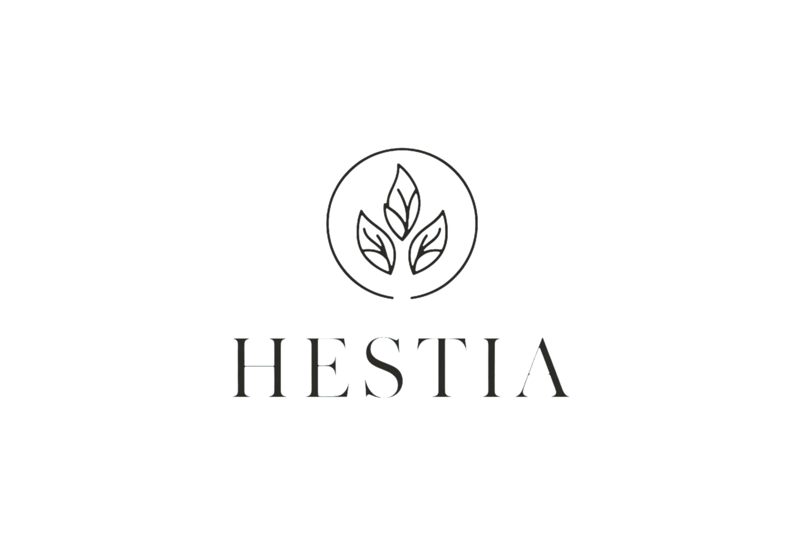

### ELDER CARE COMMAND CENTER FOR RING

> A home that cares, even when you're away.

**Ring event → scene understanding → caregiver validation → family reassurance**

[](docs/TESTING.md)
[](docs/TESTING.md)
[](LICENSE)
[](docs/ARCHITECTURE.md)


</div>

HESTIA is an elder-care command center concept for turning home activity into understandable care context and human response. The intended flow is **Ring event → scene understanding → caregiver validation → family reassurance**.

## Repository status

This repository contains the full, functional implementation of HESTIA:
- **Core Domain & Scene Engine**: Deterministic classification (S1–S4), confidence gates, and alert state machine.
- **Ring Webhook Adapter**: HMAC-SHA256 constant-time signature validation, deduplication, and normalized v1.1 payload handling.
- **AWS Bedrock Context**: Amazon Nova Micro structured natural-language explanation generation with intelligent fallback.
- **Vision & Biometric Face Matcher**: Local OpenCV 64-d cosine similarity matcher strictly separating registered care targets from unknown visitors.
- **Dynamic Operational Engine**: Full CRUD for Rooms, Ring Devices, Precision Floor Plan Mapping, Resident Care Profiles, Multi-Angle Face Studio (0°, 45°L, 45°R), Care Team Roster, and Automation Rules Engine.
- **Dynamic Device Pipeline**: Real-time camera streaming & snapshot ingestion supporting Local Webcams, Smartphone WebRTC, Ring Sandbox Simulator, and Live Ring Hardware.
- **Validator PWA**: Mobile fast-action interface (`OK`, `COMING`, `SIREN`, `I'VE ARRIVED`).

## Product intent

The problem is not simply seeing more camera events. Caregivers need to know who may need help, where they are, what happened, how serious it is, and whether someone is responding.

HESTIA is designed as a calm elder-care operating system rather than a surveillance dashboard. Ring is intended to provide home activity signals, while humans remain responsible for care decisions.

## Intended MVP

- Ring event or deterministic fixture ingestion.
- Scene states: S1 NORMAL, S2 WATCH, S3 HELP, and S4 CRITICAL.
- A desktop care command center.
- A mobile Validator fast-action interface.
- Human actions: OK, COMING, SIREN, and I'VE ARRIVED.
- Family-visible response status.

## Documentation

- [Product overview](docs/OVERVIEW.md)
- [Architecture](docs/ARCHITECTURE.md)
- [UI design](docs/UI-DESIGN.md)
- [Ring integration](docs/RING-INTEGRATION.md)
- [AWS integration](docs/AWS-INTEGRATION.md)
- [Testing](docs/TESTING.md)
- [Friction log](FRICTION-LOG.md)

## References

- [Dashboard mockup](docs/references/dashboard-mockup.png)
- [Validator mobile mockup](docs/references/validator-mobile-mockup.png)

## Visual Gallery & Screenshots

Here is the visual walkthrough of the HESTIA platform across its core modules:

### 1. Care Command Center Overview
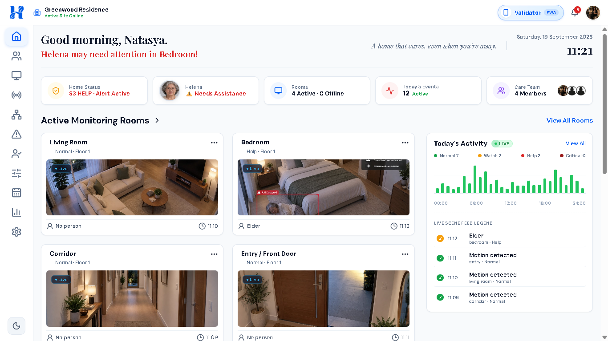
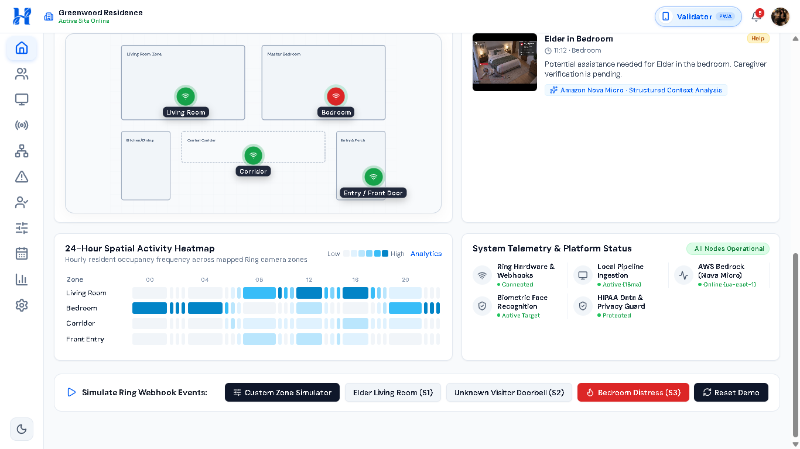
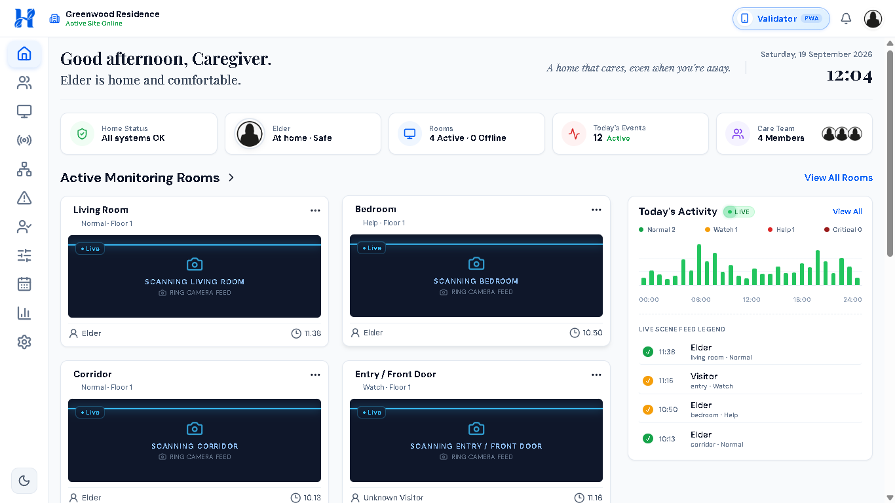

### 2. Event Inspection & Amazon Nova Micro AI Context
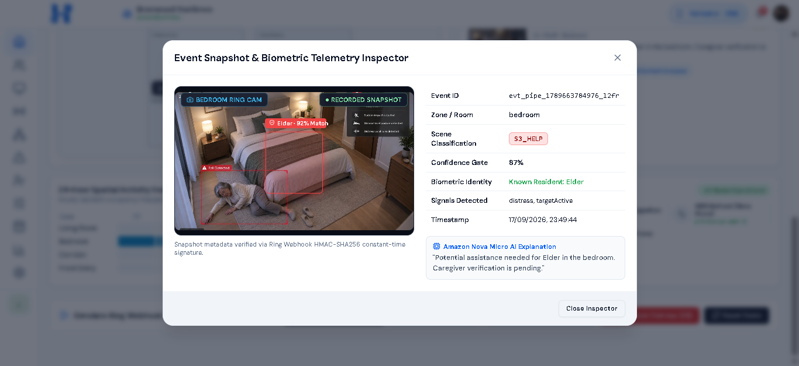

### 3. Fast-Action Validator PWA
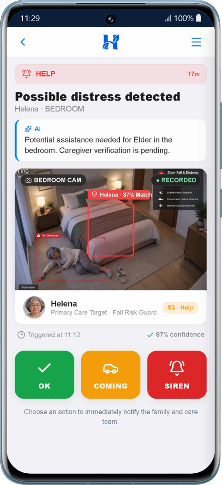
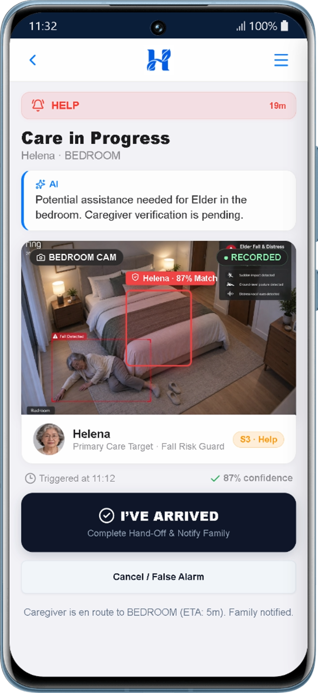

### 4. Family Reassurance & Handled State
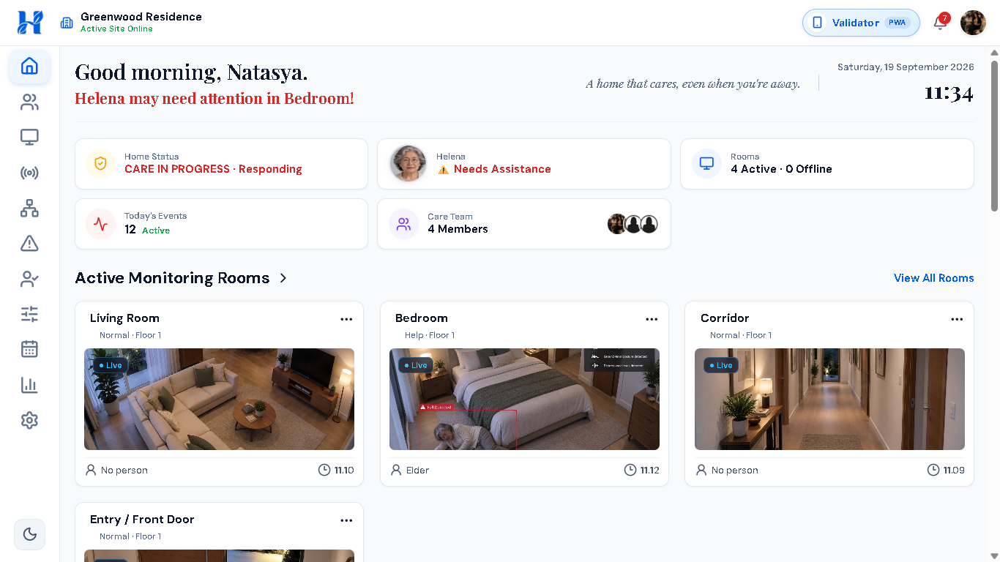

### 5. Ring Hardware Registry & Webhook Integration
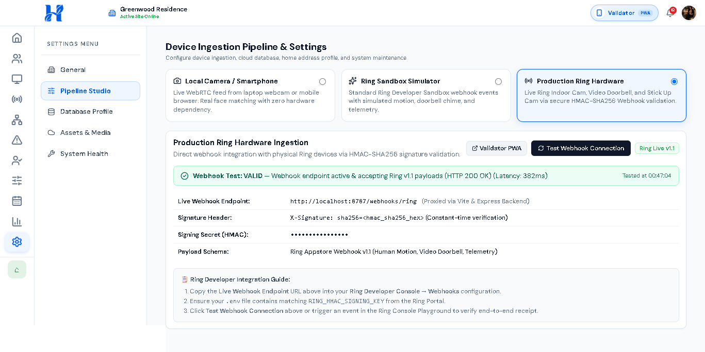
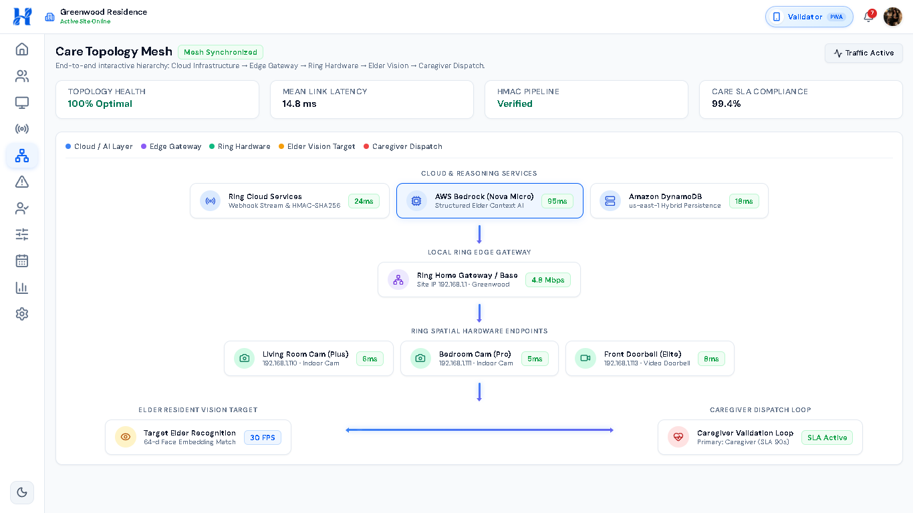

### 6. Resident Face Studio & Multi-Angle Biometrics
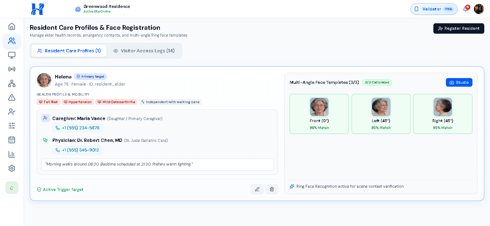
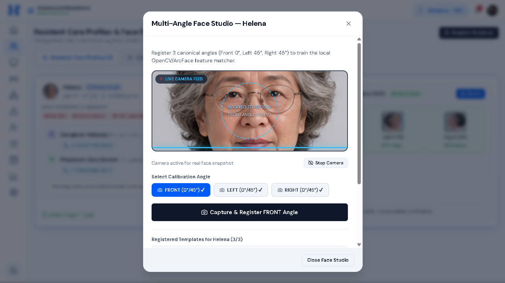

### 7. Automation Rules Engine & Insights
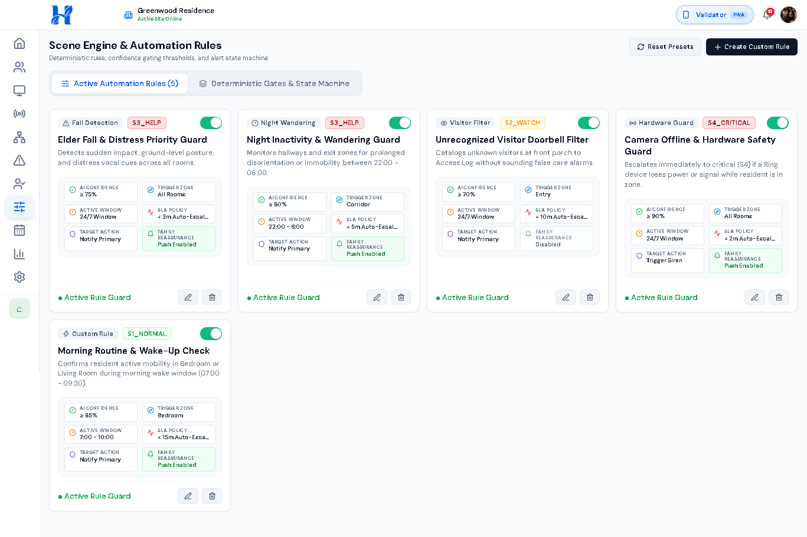
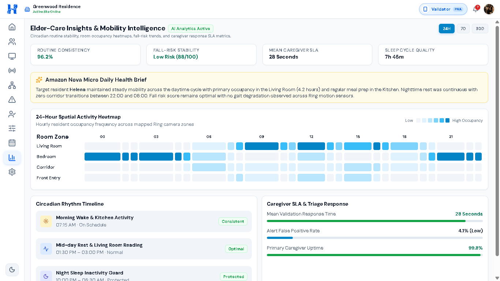

## Running the project

Install dependencies and start the frontend shell:

```bash
npm install
npm run dev
```

Start the local API in a second terminal with `npm run api`. It exposes `GET /health`, `POST /webhooks/ring`, `POST /demo/events`, `GET /api/scenes`, `GET /api/alerts`, and `POST /api/alerts/:alertId/actions`. Create a production build with `npm run build`. The current shell uses the approved logo assets from `docs/logo` and copies the required web assets into `public/logo`.

Open the Validator demo at `http://127.0.0.1:5173/?view=validator` after creating a demo alert through the API.

No credentials or tokens belong in this repository's public documentation.

## License

Distributed under the [MIT License](LICENSE).
